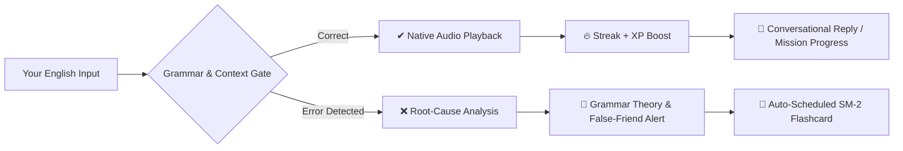

<div align="center">

# 🚪🗣️ LinguaGate

**The AI-Powered CLI English Learning Platform with Active Grammar Gating & Spaced Repetition**

[](https://nodejs.org)
[](https://pnpm.io)
[](https://en.wikipedia.org/wiki/Common_European_Framework_of_Reference_for_Languages)
[](https://en.wikipedia.org/wiki/SuperMemo)
[](tests/)
[](LICENSE)

*Master real-world English directly from your terminal. No subscription fees, no web distraction, no API keys required.*

```text
 ╭───────────────────────────────────────────────────────────╮
 │  LinguaGate — English Learning Engine                     │
 │  Active grammar gate • CEFR Path • Spaced Repetition      │
 ╰───────────────────────────────────────────────────────────╯
  🏆 Streak: 12 🔥 | ⚡ XP: 850 | 🎓 Lessons: 8 | 🧠 Due: 4
  🎯 Daily Goal: [████████░░░░] 60% (30/50 XP)
```

</div>

---

## 💡 The Philosophy

Most language apps let you practice bad grammar repeatedly without catching subtle phonetic or structural mistakes. **LinguaGate acts as a strict, intelligent compiler for your English.**



1. **Active Grammar Gate**: You cannot progress by guessing. Every response is verified for tense harmony, subject-verb agreement, and prepositions.
2. **SuperMemo SM-2 Spaced Repetition**: Mistakes are automatically converted into targeted flashcards with dynamic retention intervals (`1d ➔ 3d ➔ 7d ➔ 30d`).
3. **Phonetic Ear Training**: Native audio playback with digital time-stretching (`1.0x`, `0.7x`, `0.4x` ultra-slow) and IPA transcription so you hear every connected speech reduction (*gonna*, *whadja*, *should've*).
4. **Offline First & Atomic Storage**: Local JSON database with automatic `.bak` snapshotting and instant recovery.

---

## 🕹️ Interactive Learning Modes

| Mode | Visual | Description |
| :--- | :---: | :--- |
| **🗺️ Learning Path** | `CEFR A1 ➔ C1` | 5 complete units (27 lessons) covering phonetics, tenses, conditionals, inversion, and cleft sentences with micro-theory cheat sheets. |
| **🎧 Listening Lab** | `Audio Dictation` | Blind audio listening challenge with multi-speed playback (`[r]` 1.0x, `[s]` 0.7x, `[u]` 0.4x ultra-slow) and IPA connected speech insights. |
| **⚡ Irregular Verbs Gym** | `3 Forms Drill` | Master the 3 verb forms (*Infinitive ➔ Past Simple ➔ Past Participle*) organized into phonetic pattern families (*i-a-u*, *ought/aught*, *o-o-en*). |
| **🧩 Prepositions & Collocations** | `Common Traps` | Eliminate the #1 source of learner mistakes (*depend on*, *good at*, *make a decision*, *interested in*, *pay attention*). |
| **🎭 Roleplay Missions** | `Scenarios` | Real-world goal-oriented simulations (Brooklyn Coffee Shop, Tech Standup, Airport Customs, Hotel Check-in) with real-time objective tracking. |
| **💬 Phrasal Verbs & Slang** | `Native Vault` | Real idiomatic English categorized into Tech/Workplace, Daily Slang, and Business with literal-trap explanations. |
| **⚡ Time Attack** | `60s Sprint` | Rapid-fire grammar challenge under pressure with accuracy and speed rankings. |
| **🧠 Review Mistakes (SRS)** | `SM-2 Cards` | Review flashcards scheduled by the retention engine with theory recaps and hints. |
| **🎓 Placement Test** | `Diagnostic` | 6-question adaptive diagnostic quiz that auto-calibrates your CEFR level and auto-unlocks previous units. |
| **📦 Export to Anki & Notebook** | `Sync Deck` | One-click export to Anki `.csv` (`export/anki_deck.csv`) and Markdown study notebook (`export/my_grammar_notebook.md`). |
| **⚙️ Settings & Heatmap** | `Preferences` | Configure daily XP targets, default audio engine, and view your 30-day GitHub-style terminal heatmap. |
| **💬 Free Chat** | `Conversational` | Open conversational practice with the AI tutor with active grammar interception. |
| **🌍 Translate** | `ES ➔ EN` | Natural translation practice with detailed error-by-error score and native alternatives. |
| **✏️ Fill in the Blank** | `Grammar Drill` | High-yield cloze deletions testing prepositions, tenses, and articles. |

---

## 🗺️ CEFR Syllabus Overview

```text
├── A1: The Basics
│   ├── Introductions & Pronouns (am/is/are, possessives)
│   ├── Articles & Nouns (a/an/the, phonetic rules)
│   ├── Daily Routines (Present Simple, frequency adverbs)
│   ├── Time, Dates & Numbers (at/on/in for time)
│   └── Wh- Questions (who, what, where, when, why, how)
├── A2: Getting Around
│   ├── Past Simple — Regular & Irregular (did, went, saw)
│   ├── Past Continuous (was/were doing vs Past Simple)
│   ├── Comparatives & Superlatives (-er, more, the most)
│   ├── Modals of Ability & Permission (can, could, may)
│   ├── Future Plans (will vs going to vs present continuous)
│   └── Essential Phrasal Verbs (turn on/off, look for, pick up)
├── B1: Speaking Your Mind
│   ├── Present Perfect Simple (have you ever, since vs for)
│   ├── Present Perfect vs Past Simple (finished vs unfinished)
│   ├── Zero & First Conditionals (if + present, will + infinitive)
│   ├── Modal Verbs of Obligation & Advice (must, have to, should)
│   ├── Gerunds vs Infinitives (enjoy doing vs want to do)
│   └── Linking Words & Connectors (although, however, therefore)
├── B2: Complex Ideas
│   ├── Second & Third Conditionals (hypotheticals & past regrets)
│   ├── Passive Voice across all tenses (is done, was built, has been made)
│   ├── Narrative Tenses (Past Simple, Past Continuous, Past Perfect)
│   ├── Relative Clauses (defining vs non-defining, who/which/whose)
│   └── Modal Verbs of Deduction in Past & Present (must have, can't be)
└── C1: Fluency & Mastery
    ├── Mixed Conditionals (past condition with present result)
    ├── Inversion & Negative Fronting (Hardly had I..., Not only did we...)
    ├── Advanced Connectors & Nuance (notwithstanding, albeit, whereas)
    ├── Nominalisation & Academic English (converting verbs into nouns)
    └── Cleft Sentences for Emphasis (It was John who..., What I need is...)
```

---

## 🎧 Audio Engine & Speed Controls

LinguaGate uses `ffplay` / `mpg123` with chained digital audio filters (`atempo`) for pitch-accurate time-stretching:

```text
  Controls during Listening & Dictation:
    [r] Replay normal speed (1.0x)
    [s] Replay slow cadence (0.7x)
    [u] Replay ultra-slow phonetic breakdown (0.4x)
    [a] Hear ideal native sentence after ANY exercise across all modes
```

---

## 🚀 Quickstart & Global Installation

### Prerequisites
* [Node.js](https://nodejs.org) >= 18.0.0
* [pnpm](https://pnpm.io) >= 11.0.0
* `ffmpeg` / `ffplay` or `mpg123` (for native audio)
* [Antigravity CLI](https://antigravity.dev) (`agy`) installed and authenticated

### Global Installation (Recommended)
Install LinguaGate globally to launch it from any directory:

```bash
# Clone the repository
git clone https://github.com/Rainherz/LinguaGate.git
cd LinguaGate

# Install dependencies
pnpm install

# Link globally to your system
pnpm add -g .

# Run from anywhere!
lingua
```

### Local Development Run
```bash
pnpm start
```

---

## 📦 Anki & Study Deck Sync

All your mistakes and SRS cards can be exported to Anki Desktop/Mobile with a single command:

1. Open LinguaGate ➔ Select **`📦 Export to Anki / Study Deck`**.
2. Files are generated in `./export/`:
   * **`anki_deck.csv`**: Ready for instant import into Anki (with HTML styling and tags).
   * **`my_grammar_notebook.md`**: Complete personal study guide with XP stats and grammar tables.
3. In Anki: Click `File` ➔ `Import` ➔ Select `export/anki_deck.csv`.

---

## 🏗️ Architecture & Design Patterns

```text
src/
├── index.js              # CLI entry point, banner, main menu router
├── curriculum.json       # CEFR curriculum tree (A1 to C1)
├── data/
│   ├── collocations.json # Dependent prepositions & collocations catalog
│   └── irregular_verbs.json # 50+ irregular verbs with pattern families
├── modes/                # Controllers / Presentation layer (13 isolated modes)
│   ├── path.js           # CEFR progressive learning path
│   ├── listening.js      # Multi-speed audio dictation lab
│   ├── verbs.js          # 3-form irregular verbs gym
│   ├── collocations.js   # Prepositions & collocations gym
│   ├── roleplay.js       # Scenario roleplay with live objectives
│   ├── slang.js          # Idiomatic expressions & phrasal verbs
│   ├── timeattack.js     # 60-second speed attack
│   ├── review.js         # SuperMemo SM-2 review runner
│   ├── placement.js      # Adaptive CEFR diagnostic test
│   ├── export.js         # Anki CSV & Markdown notebook exporter
│   ├── settings.js       # User preferences & activity heatmap
│   ├── chat.js           # Grammar-gated conversational practice
│   ├── translate.js      # Spanish-to-English translation
│   └── fillblank.js      # Cloze deletion practice
├── services/             # Core Domain & Infrastructure Services
│   ├── activity.js       # Daily XP goal & 30-day terminal heatmap engine
│   ├── agy.js            # External AI subprocess gateway & prompt sanitization
│   ├── audio.js          # Resilient audio player with caching & digital filters
│   ├── collocations.js   # Prepositions evaluation & random generator
│   ├── config.js         # User preferences configuration model
│   ├── evaluator.js      # Unified exercise evaluation engine
│   ├── exporter.js       # Anki CSV RFC-compliant formatter
│   ├── history.js        # SuperMemo SM-2 persistence & intervals
│   ├── progress.js       # CEFR progression, lesson unlocks & XP
│   ├── stats.js          # In-memory session telemetry
│   ├── storage.js        # Atomic JSON persistence with .bak auto-recovery
│   └── verbs.js          # Irregular verbs pattern engine
└── ui/                   # Pure UI Components & Safe I/O
    ├── display.js        # Responsive boxen cards, headers & color palettes
    └── prompt.js         # Unified Inquirer adapter with Escape handling
```

---

## 🧪 Testing & Verification

LinguaGate is backed by a native Node.js automated test suite:

```bash
# Run all unit tests (39 tests)
pnpm test

# Run ESLint validation
pnpm lint

# Run TypeScript typechecking
pnpm typecheck

# Full CI Verification (Lint + Types + Tests)
pnpm check
```

---

## 📄 License

This project is licensed under the [MIT License](LICENSE).
