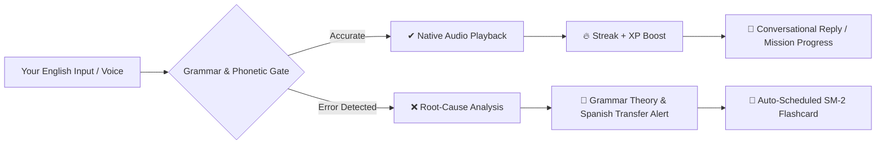

<div align="center">

# 🚪🗣️ LinguaGate

**The AI-Powered CLI English Learning Platform with Active Grammar Gating, Locally-Transcribed Speaking Lab & Personalized Tech Mock Interviews**

[](https://nodejs.org)
[](https://pnpm.io)
[](https://en.wikipedia.org/wiki/Common_European_Framework_of_Reference_for_Languages)
[](https://en.wikipedia.org/wiki/SuperMemo)
[](tests/)
[](LICENSE)

*Master real-world English directly from your terminal. Built for developers preparing for international remote jobs in USD.*

```text
 ╭───────────────────────────────────────────────────────────╮
 │  LinguaGate — English Learning Engine                     │
 │  Active grammar gate • CEFR Path • Spaced Repetition      │
 ╰───────────────────────────────────────────────────────────╯
  🏆 Streak: 12 🔥 | ⚡ XP: 850 | 🎓 Lessons: 8 | 🧠 Due: 4
  🎯 Daily Goal: [████████░░░░] 60% (30/50 XP)
```

</div>

---

## 💡 The Philosophy

Most language apps let you practice bad grammar repeatedly without catching subtle phonetic or structural mistakes. **LinguaGate acts as a strict, intelligent compiler for your English.**



1. **Active Grammar Gate**: You cannot progress by guessing. Every response is verified for tense harmony, subject-verb agreement, and prepositions.
2. **Speaking Lab with Local Speech-to-Text**: Real microphone capture transcribed on your own machine by whisper.cpp — measured WPM, word-level precision against the target, filler detection, and an articulation diagnosis that crosses per-word acoustic confidence with the target diff to separate confident substitutions from mumbling. The AI examiner is fed that evidence and constrained to it.
3. **Personalized Tech Mock Interview Simulator**: Tailor-made 4-round technical interviews for your exact role, tech stack, and seniority with official Hiring Committee verdicts.
4. **SuperMemo SM-2 Spaced Repetition**: Mistakes are automatically converted into targeted flashcards with dynamic retention intervals (`1d ➔ 3d ➔ 7d ➔ 30d`) — grammar rules *and* individual mispronounced phrases, each on its own schedule.
5. **Weak Spots on the Home Screen**: The three things you are measurably worst at, ranked by error frequency *discounted by SM-2 mastery* — so a rule you have since cleared stops crowding out what you are actually failing today.
6. **30-Day Activity Heatmap & Daily Goals**: Track daily XP progress with GitHub-style ANSI terminal heatmaps.
7. **Offline First & Atomic Storage**: Local JSON database with automatic `.bak` snapshotting and instant recovery.

---

## 🕹️ Interactive Learning Modes

| Mode | Target | Description |
| :--- | :---: | :--- |
| **🗺️ Learning Path** | `CEFR A1 ➔ C1` | 5 complete units (27 lessons) covering phonetics, tenses, conditionals, inversion, and cleft sentences with micro-theory cheat sheets. |
| **💼 Tech Mock Interview** | `Remote Hiring` | 100% personalized 4-round tech interview tailored to your role, stack, seniority, and company type with official Hiring Committee decisions. |
| **🎙️ Speaking Lab** | `Voice & Fluency` | Hardware mic recording transcribed locally by whisper.cpp, measured WPM cadence, target-vs-spoken word diff, filler detection, and self-playback comparison (`[p]`). |
| **🎧 Listening Lab** | `Audio Dictation` | Blind audio listening challenge with multi-speed playback (`[r]` 1.0x, `[s]` 0.7x, `[u]` 0.4x ultra-slow) and IPA connected speech insights. |
| **⚡ Irregular Verbs Gym** | `3 Forms Drill` | Master the 3 verb forms (*Infinitive ➔ Past Simple ➔ Past Participle*) organized into phonetic pattern families (*i-a-u*, *ought/aught*, *o-o-en*). |
| **🧩 Prepositions & Collocations** | `Common Traps` | Eliminate the #1 source of learner mistakes (*depend on*, *good at*, *make a decision*, *interested in*, *pay attention*). |
| **📚 Vocabulary Vault & Daily Quiz** | `Word Bank` | Auto-save Words of the Day and test retention with rapid 5-word definition quizzes and native audio. |
| **🎭 Roleplay Missions** | `Scenarios` | Real-world goal-oriented simulations (Brooklyn Coffee Shop, Tech Standup, Airport Customs, Hotel Check-in) with real-time objective tracking. |
| **💬 Phrasal Verbs & Slang** | `Native Vault` | Real idiomatic English categorized into Tech/Workplace, Daily Slang, and Business with literal-trap explanations. |
| **⚡ Time Attack** | `60s Sprint` | Rapid-fire grammar challenge under pressure with accuracy and speed rankings. |
| **🧠 Review Mistakes (SRS)** | `SM-2 Cards` | Review flashcards scheduled by the retention engine. Grammar cards are answered by typing; pronunciation cards are answered by **speaking**, and verified with the same speech-to-text that created them. |
| **🎓 Placement Test** | `Diagnostic` | 6-question adaptive diagnostic quiz that auto-calibrates your CEFR level and auto-unlocks previous units. |
| **📦 Export to Anki & Notebook** | `Sync Deck` | One-click export to Anki `.csv` (`export/anki_deck.csv`) and Markdown study notebook (`export/my_grammar_notebook.md`). |
| **⚙️ Settings & Heatmap** | `Preferences` | Configure daily XP targets, default audio engine, and view your 30-day GitHub-style terminal heatmap. |
| **💬 Free Chat** | `Conversational` | Open conversational practice with the AI tutor with active grammar interception. |
| **🌍 Translate** | `ES ➔ EN` | Natural translation practice with detailed error-by-error score and native alternatives. |
| **✏️ Fill in the Blank** | `Grammar Drill` | High-yield cloze deletions testing prepositions, tenses, and articles. |

---

## 💼 Tech Mock Interview Simulator

Prepare for high-paying international remote engineering interviews:

```text
 ╭───────────────────────────────────────────────────────────╮
 │  🏛️ HIRING COMMITTEE OFFICIAL DECISION                    │
 │                                                           │
 │  • Target Candidate:    Senior Backend Engineer (5+ yrs)  │
 │  • Overall Verdict:     STRONG HIRE 🟢                    │
 │  • Overall Rating:      88/100                            │
 │                                                           │
 │  📊 Competency Scores:                                    │
 │  • Technical Depth & Stack Mastery:   90/100              │
 │  • Spoken English & Fluency (CEFR):   86/100              │
 │  • STAR Structure & Conflict Triage:  88/100              │
 ╰───────────────────────────────────────────────────────────╯
```

1. **Candidate Profiling Wizard**: Select your exact discipline (*Backend, Frontend, DevOps, AI/Data, QA, Security, or Custom*), your stack (*Node.js, Go, React, Kubernetes, PostgreSQL*), and company type (*US Startup, Big Tech, Fintech*).
2. **4 Tailored Interview Rounds**:
   * **Round 1:** *Background & Architectural Philosophy*
   * **Round 2:** *System Design & Scalability Tradeoffs*
   * **Round 3:** *Live Outage Debugging & Incident Triage*
   * **Round 4:** *Behavioral STAR & Technical Conflict*
3. **Voice or Text Mode**: Answer by speaking to your microphone (with WPM tracking and audio self-monitoring) or by typing.

---

## 🎙️ Speaking Lab — Measured Fluency, Inferred Phonetics

The scorecard separates what the machine **measured** from what the model **inferred**. Both are useful. Only one is evidence.

```text
 ╭───────────────────────────────────────────────────────────╮
 │  📋 SPEAKING SCORECARD                                    │
 │                                                           │
 │  🎯 Target:   I would have avoided the automated bug.     │
 │  👂 You said: I will have a boy avoided the automatic     │
 │               book.                                       │
 │            (transcribed from your audio by whisper-cpp)   │
 │                                                           │
 │  ── MEASURED FROM AUDIO ─────────────────────────────     │
 │  • Transcript Source:      whisper-cpp ✔ measured         │
 │  • Speaking Cadence:       140 WPM                        │
 │  • Word Precision:         67%                            │
 │  • Filler Words:           2 (um, like)                   │
 │                                                           │
 │  ── INFERRED BY THE MODEL FROM THE TRANSCRIPT ───────     │
 │  • Estimated Level:        Band 5.0 (Modest)              │
 │  • Word Stress Score:      45/100 ⚠                       │
 │  • Connected Speech Score: 40/100 ⚠                       │
 ╰───────────────────────────────────────────────────────────╯
```

### What is actually measured

* **Physical voice capture** — 16 kHz mono recording (PulseAudio/PipeWire/ALSA on Linux, DirectShow on Windows, AVFoundation on macOS).
* **Local speech-to-text** — your recording is transcribed **on your machine** by [whisper.cpp](https://github.com/ggerganov/whisper.cpp) or `openai-whisper`. No audio leaves your computer. With no engine installed the lab still runs, and the scorecard reads `self-reported ⚠` instead of pretending to measure.
* **Speaking cadence (WPM)** — computed from the transcribed word count over the *measured speech span* (first to last spoken segment), so the silence between pressing record and starting to talk does not deflate the reading.
* **Word precision** — a token-level diff between the target sentence and your transcript, with mismatches highlighted on both sides so a substitution (*bug* → *book*) is visible, not just "something is missing".
* **Filler words** — counted from the real transcript.
* **Articulation confidence + diagnosis** — whisper.cpp reports a per-token probability: how strongly the audio supported each word it heard. Crucially, that number alone is **not** a pronunciation score — it measures how sure the recognizer is of what *it* heard, not whether you said the right word. Say *"pre-write the sign"* for *"prioritize"* and every token scores 0.97+ while half the sentence is wrong. So confidence is crossed with the target-vs-spoken diff:

  | | high confidence | low confidence |
  | :--- | :--- | :--- |
  | **matches target** | correct | right word, unclear delivery |
  | **does not match** | **confident substitution** — you spoke clearly and said something else | slurred into a different word |

  A *confident substitution* is the most actionable error a learner can get, and it is exactly the one a raw clarity score hides.
* **Self-playback comparison** — `[p]` replays your own recording, `[r]` the native model, `[s]`/`[u]` at 0.7x/0.4x. Your ear does the comparing; this part needs no algorithm at all.
* **Silence rejection** — Whisper hallucinates phrases such as `"You"` or `"Thank you"` when fed silence. Those are discarded, so an empty recording is never scored.

```text
  • Articulation Confidence: 99/100  (how sure the recognizer was of what it heard)
  • Diagnosis:               confident substitution ✖
  • What changed:
        prioritize                     ➔  pre-write the sign,      (0.97)
        production outage immediately. ➔  revolution of the HMI.   (0.95)
    You articulated confidently — but you articulated different words.
```

Contiguous mismatches are aligned with an LCS pass and grouped into whole spans, so you read `prioritize ➔ "pre-write the sign,"` — a diagnosable event — rather than four separately flagged words including a bewildering bare `the`.

### What is inferred — but now grounded

The IELTS band estimate, Word Stress Score, Connected Speech Score and IPA placement tips still come from an LLM. This project performs **no** spectral, formant, pitch or intonation analysis.

What changed: the examiner is no longer guessing from spelling. It receives the diagnosis above and is constrained to it:

```text
Acoustic evidence from the speech recognizer: You articulated confidently — but
you articulated different words. 3 word(s) were transcribed with high certainty
and still did not match the target.
Target phrase -> what the recognizer actually heard:
  "prioritize" -> "pre-write the sign," (confidence 0.97);
  "production outage immediately." -> "revolution of the HMI." (confidence 0.95).
High confidence here means the learner articulated clearly and still produced
the wrong sounds — diagnose which phonemes turned the target phrase into what
was heard.
Base your pronunciation diagnosis on these words only.
Do not invent errors for words not listed here.
```

So *which* words you fumbled, and *whether you fumbled them confidently or by mumbling*, is measured. *Why* they came out wrong — final-consonant devoicing, S-cluster epenthesis, misplaced stress — remains a well-informed inference from a model that cannot hear you.

**Read the upper half as evidence and the lower half as an expert reading of that evidence.**

### Enabling measured mode

```bash
# Arch / CachyOS
sudo pacman -S whisper-cpp

# Then fetch a model into a directory LinguaGate searches:
mkdir -p ~/.local/share/whisper && cd ~/.local/share/whisper
curl -LO https://huggingface.co/ggerganov/whisper.cpp/resolve/main/ggml-base.en.bin
```

LinguaGate auto-detects the binary and model. Override with `sttEngine` / `sttModel` in your config, or set `sttEngine: "off"` to stay in self-reported mode.

### Mispronunciations become flashcards

Every measured substitution span is filed as its own SM-2 card, carrying the target phrase, what actually came out, and the recognizer's confidence:

```text
🎙️  Pronunciation: "prioritize"
      target : prioritize
      spoken : pre-write the sign,   (0.97)
      interval: 1d
```

Reviewing one does **not** ask you to type it — that would prove nothing about pronunciation. It replays the native model, records you again, transcribes, and only advances the interval when the diff comes back clean. The measurement that created the card is the measurement that clears it.

---

## 🩹 Weak Spots

Every session opens with the three things you are measurably worst at:

```text
  🩹 Your weak spots (what to practice today)
    🎙️  prioritize     ×2  came out as "priority ties"
    🎙️  schedule       ×1  came out as "es-schedule"
    📖  third_person_s ×3  came out as "it need"
```

Note the ordering: `third_person_s` has the **highest** raw error count and ranks **last**. Raw counts are a museum — a rule you fumbled repeatedly last month sits at the top forever even after you have mastered it. Each entry is weighted by `1 / (1 + repetition)`, using the SM-2 repetition streak as the app's own measure of consolidation. Mastered items are demoted but never vanish, because a cleared rule can always resurface.

---

## 🔊 Speech Synthesis

Reference audio comes from a swappable engine, chosen by **output quality** rather than by what happens to be installed:

| Engine | Voice | Network | Speed control |
| :--- | :--- | :---: | :--- |
| `piper` | neural, natural | no | native |
| `google` | natural | **yes** | playback time-stretch |
| `espeak-ng` | formant, robotic | no | native |

The ordering is deliberate. This app is used for **shadowing** — you imitate the reference voice — so ranking an audibly robotic engine above a natural-sounding one would teach the wrong prosody. `espeak-ng` is a fallback for when nothing better exists, not a preference.

Local engines change the speaking rate at synthesis time, which preserves pitch. Only the pre-rendered network clip has to be time-stretched during playback:

```text
espeak-ng  normal      38ms   2.58s clip
espeak-ng  slow        19ms   3.78s clip
espeak-ng  ultra-slow  21ms   4.93s clip
google     normal     833ms   (network round trip per phrase)
```

Set `ttsEngine` to `auto`, `piper`, `google`, `espeak-ng`, or `off`. For the best offline voice:

```bash
pip install piper-tts
# then drop a .onnx voice into a directory LinguaGate searches:
mkdir -p ~/.local/share/piper   # or set PIPER_MODEL / ttsModel
```

Clips are cached under `cache/audio`, keyed by engine, speed and voice — not by text alone, so two engines can never serve each other's audio.

---

## 📊 30-Day Activity Heatmap & Daily Goals

Stay accountable with a GitHub-style terminal matrix:

```text
  🎯 Daily Goal: [████████████████░░░░] 80% (40/50 XP)

  Activity Heatmap (Past 30 Days):
  Sun: ░░ ░░ ▒▒ ░░
  Mon: ░░ ▒▒ ▓▓ ░░
  Tue: ░░ ░░ ▒▒ ░░
  Wed: ░░ ▒▒ ░░ ░░
  Thu: ░░ ▓▓ ▒▒ ░░
  Fri: ░░ ▒▒ ██ ░░
  Sat: ░░ ░░ ▒▒ ░░
  Legend: ░░ 0 XP  ▒▒ 1-49 XP  ▓▓ 50-99 XP  ██ 100+ XP
```

---

## 🗺️ CEFR Syllabus Overview

```text
├── A1: The Basics
│   ├── Introductions & Pronouns (am/is/are, possessives)
│   ├── Articles & Nouns (a/an/the, phonetic rules)
│   ├── Daily Routines (Present Simple, frequency adverbs)
│   ├── Time, Dates & Numbers (at/on/in for time)
│   └── Wh- Questions (who, what, where, when, why, how)
├── A2: Getting Around
│   ├── Past Simple — Regular & Irregular (did, went, saw)
│   ├── Past Continuous (was/were doing vs Past Simple)
│   ├── Comparatives & Superlatives (-er, more, the most)
│   ├── Modals of Ability & Permission (can, could, may)
│   ├── Future Plans (will vs going to vs present continuous)
│   └── Essential Phrasal Verbs (turn on/off, look for, pick up)
├── B1: Speaking Your Mind
│   ├── Present Perfect Simple (have you ever, since vs for)
│   ├── Present Perfect vs Past Simple (finished vs unfinished)
│   ├── Zero & First Conditionals (if + present, will + infinitive)
│   ├── Modal Verbs of Obligation & Advice (must, have to, should)
│   ├── Gerunds vs Infinitives (enjoy doing vs want to do)
│   └── Linking Words & Connectors (although, however, therefore)
├── B2: Complex Ideas
│   ├── Second & Third Conditionals (hypotheticals & past regrets)
│   ├── Passive Voice across all tenses (is done, was built, has been made)
│   ├── Narrative Tenses (Past Simple, Past Continuous, Past Perfect)
│   ├── Relative Clauses (defining vs non-defining, who/which/whose)
│   └── Modal Verbs of Deduction in Past & Present (must have, can't be)
└── C1: Fluency & Mastery
    ├── Mixed Conditionals (past condition with present result)
    ├── Inversion & Negative Fronting (Hardly had I..., Not only did we...)
    ├── Advanced Connectors & Nuance (notwithstanding, albeit, whereas)
    ├── Nominalisation & Academic English (converting verbs into nouns)
    └── Cleft Sentences for Emphasis (It was John who..., What I need is...)
```

---

## 🎧 Audio Engine & Speed Controls

LinguaGate uses `ffplay` / `mpg123` with chained digital audio filters (`atempo`) for pitch-accurate time-stretching:

```text
  Controls during Listening & Dictation:
    [r] Replay normal speed (1.0x)
    [s] Replay slow cadence (0.7x)
    [u] Replay ultra-slow phonetic breakdown (0.4x)
    [p] Play YOUR recorded voice (Speaking & Interview modes)
    [a] Hear ideal native sentence after ANY exercise across all modes
```

---

## 🚀 Quickstart & Global Installation

### Prerequisites
* [Node.js](https://nodejs.org) >= 18.0.0
* [pnpm](https://pnpm.io) >= 11.0.0
* `ffmpeg` / `ffplay` or `mpg123` (for native audio playback & microphone recording)
* [Antigravity CLI](https://antigravity.dev) (`agy`) installed and authenticated

### Global Installation (Recommended)
Install LinguaGate globally to launch it from any directory:

```bash
# Clone the repository
git clone https://github.com/Rainherz/LinguaGate.git
cd LinguaGate

# Install dependencies
pnpm install

# Link globally to your system
pnpm add -g .

# Run from anywhere!
lingua
```

### Local Development Run
```bash
pnpm start
```

---

## 📦 Anki & Study Deck Sync

All your mistakes and SRS cards can be exported to Anki Desktop/Mobile with a single command:

1. Open LinguaGate ➔ Select **`📦 Export to Anki / Study Deck`**.
2. Files are generated in `./export/`:
   * **`anki_deck.csv`**: Ready for instant import into Anki (with HTML styling and tags).
   * **`my_grammar_notebook.md`**: Complete personal study guide with XP stats and grammar tables.
3. In Anki: Click `File` ➔ `Import` ➔ Select `export/anki_deck.csv`.

---

## 🏗️ Architecture & Design Patterns

```text
src/
├── index.js              # CLI entry point, banner, main menu router
├── curriculum.json       # CEFR curriculum tree (A1 to C1)
├── data/
│   ├── checkpoints.json  # 20-question certification exams per CEFR level
│   ├── collocations.json # Dependent prepositions & collocations catalog
│   └── irregular_verbs.json # 50+ irregular verbs with pattern families
├── modes/                # Controllers / Presentation layer (17 isolated modes)
│   ├── path.js           # CEFR progressive learning path
│   ├── interview.js      # Personalized 4-round tech mock interview simulator
│   ├── speaking.js       # Speaking lab: local STT, word diff & AI review
│   ├── listening.js      # Multi-speed audio dictation lab
│   ├── verbs.js          # 3-form irregular verbs gym
│   ├── collocations.js   # Prepositions & collocations gym
│   ├── vocabulary.js     # Vocabulary vault & 5-word daily quiz
│   ├── checkpoint.js     # CEFR unit certification checkpoint exam
│   ├── onboarding.js     # First-time user setup & diagnostic wizard
│   ├── roleplay.js       # Scenario roleplay with live objectives
│   ├── slang.js          # Idiomatic expressions & phrasal verbs
│   ├── timeattack.js     # 60-second speed attack
│   ├── review.js         # SuperMemo SM-2 review runner
│   ├── placement.js      # Adaptive CEFR diagnostic test
│   ├── export.js         # Anki CSV & Markdown notebook exporter
│   ├── settings.js       # User preferences & activity heatmap
│   ├── chat.js           # Grammar-gated conversational practice
│   ├── translate.js      # Spanish-to-English translation
│   └── fillblank.js      # Cloze deletion practice
├── services/             # Core Domain & Infrastructure Services
│   ├── activity.js       # Daily XP goal & 30-day terminal heatmap engine
│   ├── agy.js            # External AI subprocess gateway & prompt sanitization
│   ├── audio.js          # Resilient audio player with caching & digital filters
│   ├── checkpoint.js     # Checkpoint exam loader & certificate persistence
│   ├── collocations.js   # Prepositions evaluation & random generator
│   ├── config.js         # User preferences configuration model
│   ├── ai/               # AI port + adapters (agy CLI, Anthropic SDK, fake)
│   ├── tutor.js          # Domain tutoring prompts (provider-agnostic)
│   ├── evaluator.js      # Unified exercise evaluation engine
│   ├── exporter.js       # Anki CSV RFC-compliant formatter
│   ├── history.js        # SuperMemo SM-2 persistence & intervals
│   ├── interview.js      # Candidate profiling, question generator & hiring engine
│   ├── progress.js       # CEFR progression, lesson unlocks & XP
│   ├── recorder.js       # Multiplatform hardware microphone capture
│   ├── speech.js         # WPM, word diff, articulation diagnosis & AI evaluator
│   ├── transcriber.js    # Local STT + per-word acoustic confidence
│   ├── tts.js            # Speech synthesis port (piper / google / espeak-ng)
│   ├── stats.js          # In-memory session telemetry
│   ├── weakspots.js      # Mastery-weighted ranking of recurring mistakes
│   ├── storage.js        # Atomic JSON persistence with .bak auto-recovery
│   ├── verbs.js          # Irregular verbs pattern engine
│   └── vocabulary.js     # Word of the Day persistence & quiz generator
└── ui/                   # Pure UI Components & Safe I/O
    ├── scripted-input.js # Queue-backed input source for driving modes in tests
    ├── display.js        # Responsive boxen cards, headers & color palettes
    └── prompt.js         # Unified Inquirer adapter with Escape handling
```

---

## 🧪 Testing & Verification

LinguaGate is backed by a native Node.js automated test suite:

```bash
# Run all unit tests (63 tests)
pnpm test

# Run ESLint validation
pnpm lint

# Run TypeScript typechecking
pnpm typecheck

# Full CI Verification (Lint + Types + Tests)
pnpm check
```

---

## 📄 License

This project is licensed under the [MIT License](LICENSE).
